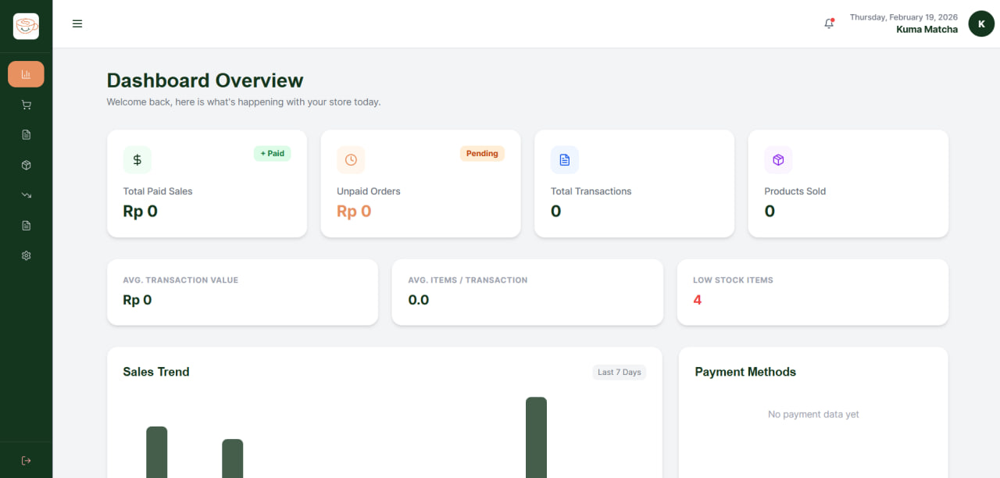
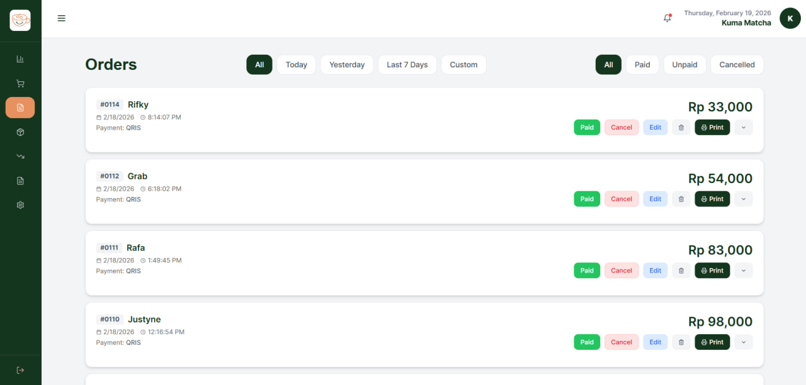
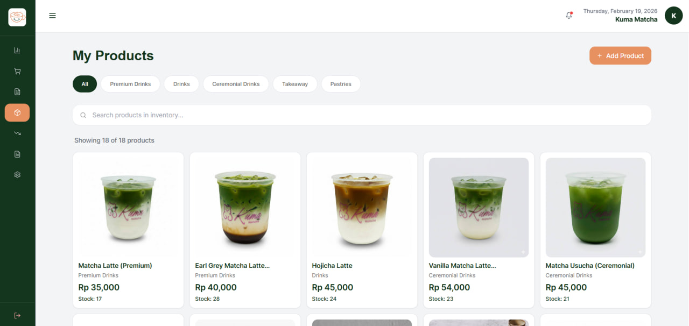
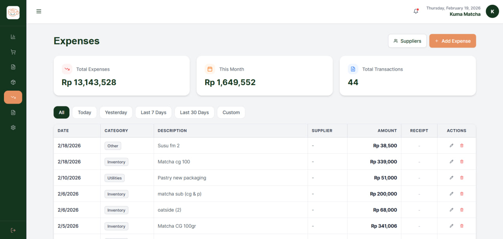

# ☕ Krema POS | Cloud-Based Point of Sale

[](https://opensource.org/licenses/MIT)
[](https://reactjs.org/)
[](https://firebase.google.com/)
[](https://tailwindcss.com/)

**Krema POS** is a comprehensive, cloud-based Point of Sale system designed for cafes and small businesses. Built with React and Firebase, it streamlines operations by connecting front-of-house sales with back-of-house inventory and expense tracking.

It features real-time synchronization, recipe-based inventory deduction, and direct Bluetooth thermal printing support.

---

## 📸 Screenshots

### Dashboard, POS, Orders, Inventory, & Expenses

<div style="display: flex; gap: 10px;">
  
  
  
  
  

</div>
-->

---

## 💎 Key Features

### 🛒 Smart Point of Sale
* **Dynamic Cart:** Handle complex orders with product variants/add-ons (e.g., Sugar levels, Toppings).
* **Discounts:** Apply percentage or fixed-amount discounts.
* **Payment Methods:** Support for Cash, QRIS, Debit, Credit, and "Compliment" (Free) orders.
* **Tax & Service Charge:** Configurable global settings for tax and service fees.

### 📦 Advanced Inventory & Recipe Management
* **Ingredient Linking:** Define recipes for products (e.g., 1 Latte = 18g Coffee Beans + 200ml Milk).
* **Auto-Deduction:** Selling a product automatically deducts the raw ingredients from stock.
* **Low Stock Alerts:** Real-time notifications when inventory hits minimum thresholds.

### 🖨️ Hardware Integration
* **Bluetooth Printing:** Direct integration with Bluetooth Thermal Printers (ESC/POS) for receipts.
* **Receipt Customization:** Custom headers, footers, and logo support on printed receipts.

### 💰 Expense & Supplier Management
* **Expense Tracking:** Log operational costs, rent, and salaries.
* **Receipt Uploads:** Upload and store images of physical expense receipts via Firebase Storage.
* **Supplier Database:** Manage contact details for vendors.

### 📊 Analytics & Reporting
* **Real-time Dashboard:** View daily sales, top-selling items, and sales trends.
* **Profit & Loss:** Calculate net profit by subtracting COGS (Cost of Goods Sold) and Expenses from Revenue.
* **Export:** Download detailed sales reports as CSV files.

---

## � Technical Architecture

*   **Frontend:** React.js (Create React App)
*   **Styling:** Tailwind CSS
*   **Icons:** Lucide React
*   **Backend:** Firebase (BaaS)
    *   **Authentication:** Email/Password login & signup.
    *   **Firestore:** Real-time NoSQL database for orders, products, and inventory.
    *   **Storage:** Image hosting for product photos and expense receipts.

---

## 🚀 Deployment & Local Setup

### Prerequisites
* Node.js (v14.0 or higher)
* A Firebase Project

### Installation
1. **Clone the Project**
   ```bash
   git clone https://github.com/yourusername/krema-pos.git
   cd krema-pos
   ```

2. **Install Project Dependencies**
   ```bash
   npm install
   ```

3. **Configure Environment Variables**
   Create a `.env.local` file in the root directory and add your Firebase credentials:
   ```bash
   REACT_APP_FIREBASE_API_KEY=your_key
   REACT_APP_FIREBASE_AUTH_DOMAIN=your_domain.firebaseapp.com
   REACT_APP_FIREBASE_PROJECT_ID=your_project_id
   REACT_APP_FIREBASE_STORAGE_BUCKET=your_bucket.appspot.com

4. **Launch Application**
   ```bash
   npm start

## 📐 Data Schema (Architecture)
The database is structured for maximum scalability:

users/: Store user roles (Admin vs. Staff) and permissions.

products/: Contains base prices, categories, and linked ingredient IDs.

orders/: Time-stamped transactions with nested line-item arrays.

expenses/: Documented overhead costs for automated P&L reporting.

## 📝 Roadmap & Future Enhancements
[ ] Offline Mode: Implement Service Workers for PWA functionality.

[ ] Kitchen Display System (KDS): A specialized view for kitchen staff.

[ ] Customer Loyalty Program: Points-based system linked to user phone numbers.


## 👨‍💻 Author
Livy Pang

LinkedIn: linkedin.com/in/yourprofile

Portfolio: yourwebsite.com

## ⚖️ License
This project is licensed under the MIT License - see the LICENSE file for details.